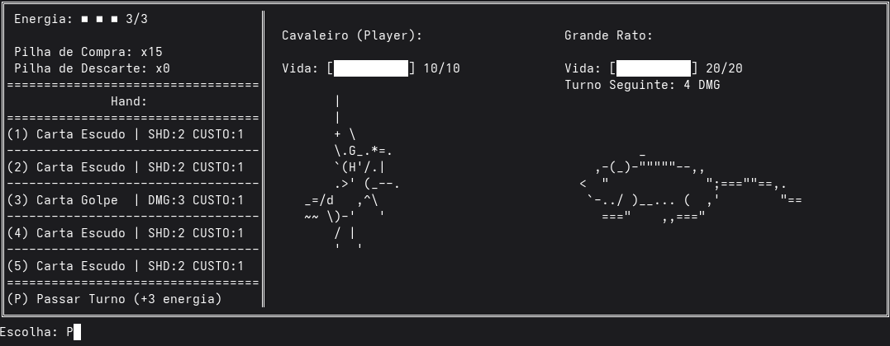

# Jogo de RPG de cartas

Esse é um jogo feito inteiramente em Java como parte da disciplina MC322 da Unicamp. Sua parte gráfica é inteiramente feita em terminal, usando como inspiração jogos feitos em ASCII ART, além de outras inspirações em jogos de carta e RPG.

# Dependencias

+ JDK (Java Development Kit), que é o que contém o compilador javac para criar os programas.

# Como compilar esse projeto?
na pasta do repositório cole ou escreva:

```javac -d bin $(find src -name "*.java")```
```java -cp bin App```

# Como Jogar?

O jogo é baseado em turnos, onde você deve derrotar o formidável Grande Rato, que anda colocando o terror nos vilarejos perto do castelo do Rei. O personagem possui 3 atributos principais: vida, energia e escudo. Se sua vida chegar a 0 você perde! O escudo cumpre a função de te proteger, ele reduz todo o dano inimigo em sua quantidade. A energia representa o seu limite de cartas usáveis por turno, ou seja, ao zerar a energia, você não consegue mais usar cartas! Assim, você deve controlar esse 3 recursos afim de derrotar o inimigo. Boa sorte!

+ Vocẽ recebe um deck com 20 cartas, recebendo 5 cartas cada turno para sua hand, que ao final de sua jogada são descartadas.
+ Escolha uma carta dos indices de 1 até 5, + Enter, a carta de Golpe você da dano e  com a carta escudo ganha escudo.
+ Para recuperar sua energia e acabar seu turno aperte a tecla "P" + Enter 

# Interface do Jogo




