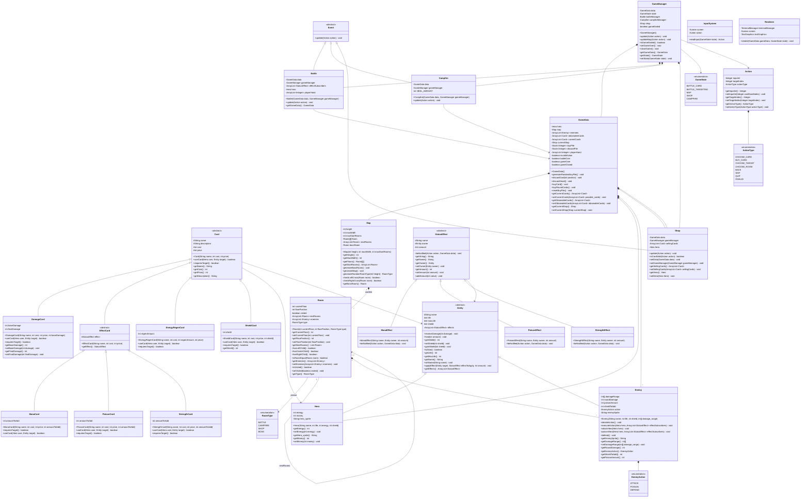

# Jogo de RPG de cartas

Esse é um jogo feito inteiramente em Java como parte da disciplina MC322 da Unicamp. Sua parte gráfica é inteiramente feita em terminal, usando como inspiração jogos feitos em ASCII ART, além de outras inspirações em jogos de carta e RPG.

# Dependências

+ JDK (Java Development Kit), que é o que contém o compilador javac para criar os programas.

# Como compilar esse projeto?
Na pasta do repositório e cole ou escreva:

```sh
gradle wrapper

chmod +x gradlew

./gradlew build

./gradlew run
```

# Como Jogar?

O jogo é baseado em turnos, onde você deve derrotar o formidável Grande Rato, que anda colocando o terror nos vilarejos perto do castelo do Rei. O personagem possui 3 atributos principais: vida, energia e escudo. Se sua vida chegar a 0 você perde! O escudo cumpre a função de te proteger, ele reduz todo o dano inimigo em sua quantidade. A energia representa o seu limite de cartas usáveis por turno, ou seja, ao zerar a energia, você não consegue mais usar cartas! Assim, você deve controlar esse 3 recursos afim de derrotar o inimigo. Boa sorte!

+ Você recebe um deck com 20 cartas, recebendo 5 cartas cada turno para sua hand, que ao final de sua jogada são descartadas.
+ Escolha uma carta dos indices de 1 até 5 por meio do teclado. Existem várias cartas no jogo cada uma com sua função! No final desse README existe uma descrição do que cada um dos indicadores das cartas representa.
+ Sempre que escolher uma carta que ataque um inimigo, escolha qual inimigo atacar, aperte 1 ou 2 no teclado. Caso desista de usar a carta que tem alvo, apenas aperte a tecla ESC para voltar atrás.
+ Para recuperar sua energia e acabar seu turno aperte a tecla P ou Enter 

Siglas:
+ DMG: Dano causado
+ SHD: Escudo recebido
+ PSN: Quantidade de veneno infligida
+ STR: Quantidade de buff de força ganho
+ MANA: Duração do efeito Mana Overflow, que aumenta a energia máxima em 2
+ REG: Quantidade de energia recuperada

Patch Notes Version 0.1.6

Agora com loja e fogueira! A sigla S em cor amarela representa uma loja, na qual você pode comprar novas cartas! A fogueira recupera sua vida e tem sigla F com cor vermelha. Batalhas são representadas com cor branca e sigla R.
A loja foi implementada por meio do design pattern Builder (https://refactoring.guru/design-patterns/builder)
A fogueira foi implementada por meio do design pattern MVC (https://www.geeksforgeeks.org/system-design/mvc-design-pattern/)

# Interface do Luta


# Interface Mapa


# Aviso
    JAVADOC, Testes e código Mermaid para gerar UML foram implementados com ajuda de LLM (IA generativa). Referências para a geração do mapa foram retiradas de algoritmos da geração de mapa do Slay The Spire (https://steamcommunity.com/sharedfiles/filedetails/?id=2830078257).

Nome: Felipe Pedral Cruz de Oliveira RA: 220826
Nome: Mateus Carioca RA: 282046

# UML


```mermaid
classDiagram
    %% =======================
    %% PACOTE: Cards
    %% =======================
    class Card {
        <<abstract>>
        #String name
        #String description
        #int cost
        #int price
        +Card(String name, int cost, int price)
        +useCard(Hero user, Entity target) boolean
        +requiresTarget() boolean
        +getName() String
        +getCost() int
        +getPrice() int
        +getDescription() String
    }

    class DamageCard {
        -int baseDamage
        -int finalDamage
        +DamageCard(String name, int cost, int price, int baseDamage)
        +useCard(Hero user, Entity target) boolean
        +requiresTarget() boolean
        +getBaseDamage() int
        +setBaseDamage(int damage) void
        +getFinalDamage() int
        +setFinalDamage(int finalDamage) void
    }

    class EffectCard {
        <<abstract>>
        #StatusEffect effect
        +EffectCard(String name, int cost, int price)
        +getEffect() StatusEffect
    }

    class EnergyRegenCard {
        -int regenAmount
        +EnergyRegenCard(String name, int cost, int regenAmount, int price)
        +useCard(Hero user, Entity target) boolean
        +requiresTarget() boolean
    }

    class ManaCard {
        -int amountToAdd
        +ManaCard(String name, int cost, int price, int amountToAdd)
        +requiresTarget() boolean
        +useCard(Hero user, Entity target) boolean
    }

    class PoisonCard {
        -int amountToAdd
        +PoisonCard(String name, int cost, int price, int amountToAdd)
        +useCard(Hero user, Entity target) boolean
        +requiresTarget() boolean
    }

    class ShieldCard {
        -int shield
        +ShieldCard(String name, int cost, int price, int shield)
        +useCard(Hero user, Entity target) boolean
        +requiresTarget() boolean
        +getShield() int
    }

    class StrengthCard {
        -int amountToAdd
        +StrengthCard(String name, int cost, int price, int amountToAdd)
        +useCard(Hero user, Entity target) boolean
        +requiresTarget() boolean
    }

    Card <|-- DamageCard
    Card <|-- EffectCard
    Card <|-- EnergyRegenCard
    Card <|-- ShieldCard
    EffectCard <|-- ManaCard
    EffectCard <|-- PoisonCard
    EffectCard <|-- StrengthCard

    %% =======================
    %% PACOTE: Core
    %% =======================
    class Event {
        <<abstract>>
        +update(Action action) void
    }

    class Battle {
        -GameData data
        -GameManager gameManager
        -ArrayList~StatusEffect~ effectSubscribers
        -Hero hero
        -ArrayList~Integer~ playerHand
        +Battle(GameData data, GameManager gameManager)
        +update(Action action) void
        +getGameData() GameData
    }

    class Campfire {
        -GameData data
        -GameManager gameManager
        -int HEAL_AMOUNT
        +Campfire(GameData data, GameManager gameManager)
        +update(Action action) void
    }

    class Shop {
        -GameData data
        -GameManager gameManager
        -ArrayList~Card~ sellingCards
        -Hero hero
        +update(Action action) void
        +isCardValid(Action action) boolean
        +setData(GameData data) void
        +setGameManager(GameManager gameManager) void
        +getSellingCards() ArrayList~Card~
        +setSellingCards(ArrayList~Card~ sellingCards) void
        +getHero() Hero
        +setHero(Hero hero) void
    }

    class GameData {
        -Hero hero
        -Map map
        -ArrayList~Enemy~ enemies
        -ArrayList~Card~ obtainableCards
        -ArrayList~Card~ currentCards
        -Shop currentShop
        -Stack~Integer~ buyPile
        -Stack~Integer~ discardPile
        -ArrayList~Integer~ playerHand
        -boolean invalidAction
        -boolean battleOver
        -boolean gameOver
        -boolean gameClosed
        +GameData()
        +generateRandomBuyPile() void
        +discardCard(int position) void
        +discardHand() void
        +buyCard() void
        +buyRoundCards() void
        +resetBuyPile() void
        +getCurrentCards() ArrayList~Card~
        +setCurrentCards(ArrayList~Card~ possible_cards) void
        +getObtainableCards() ArrayList~Card~
        +setObtainableCards(ArrayList~Card~ obtainableCards) void
        +getCurrentShop() Shop
        +setCurrentShop(Shop currentShop) void
    }

    class GameManager {
        -GameData data
        -GameState state
        -Battle battleManager
        -Campfire campfireManager
        -Shop shop
        -boolean gameEnded
        +GameManager()
        +update(Action action) void
        +updateMap(Action action) void
        +isGameEnded() boolean
        +setGameOver() void
        +closeGame() void
        +getGameData() GameData
        +getState() GameState
        +setState(GameState state) void
    }

    class GameState {
        <<enumeration>>
        BATTLE_CARD
        BATTLE_TARGETING
        MAP
        SHOP
        CAMPFIRE
    }

    class InputSystem {
        -Screen screen
        -Action action
        +readInput(GameState state) Action
    }

    class Renderer {
        -TerminalManager terminalManager
        -Screen screen
        -TextGraphics textGraphics
        +render(GameData gameData, GameState state) void
    }

    Event <|-- Battle
    Event <|-- Campfire
    Event <|-- Shop
    
    GameManager *-- GameData
    GameManager *-- Battle
    GameManager *-- Campfire
    GameManager *-- Shop
    GameManager --> GameState
    
    Battle --> GameData
    Campfire --> GameData
    Shop --> GameData

    %% =======================
    %% PACOTE: Effects
    %% =======================
    class StatusEffect {
        <<abstract>>
        #String name
        #Entity owner
        #int amount
        +beNotified(Action action, GameData data) void
        +getString() String
        +getName() String
        +getOwner() Entity
        +setOwner(Entity owner) void
        +getAmount() int
        +setAmount(int amount) void
        +addAmount(int value) void
    }

    class ManaEffect {
        +ManaEffect(String name, Entity owner, int amount)
        +beNotified(Action action, GameData data) void
    }

    class PoisonEffect {
        +PoisonEffect(String name, Entity owner, int amount)
        +beNotified(Action action, GameData data) void
    }

    class StrengthEffect {
        +StrengthEffect(String name, Entity owner, int amount)
        +beNotified(Action action, GameData data) void
    }

    StatusEffect <|-- ManaEffect
    StatusEffect <|-- PoisonEffect
    StatusEffect <|-- StrengthEffect

    %% =======================
    %% PACOTE: Entities
    %% =======================
    class Action {
        -Integer inputInt
        -Integer targetIndex
        -ActionType actionType
        +getInputInt() Integer
        +setInputInt(Integer cardHandIndex) void
        +getTargetIndex() Integer
        +setTargetIndex(Integer targetIndex) void
        +getActionType() ActionType
        +setActionType(ActionType actionType) void
    }

    class ActionType {
        <<enumeration>>
        CHOOSE_CARD
        BUY_CARD
        CHOOSE_TARGET
        CHOOSE_ROOM
        BACK
        SKIP
        QUIT
        INVALID
    }

    class Entity {
        <<abstract>>
        #String name
        #int life
        #int maxLife
        #int shield
        -ArrayList~StatusEffect~ effects
        +receiveDamage(int damage) void
        +heal(int amount) void
        +getShield() int
        +setShield(int shield) void
        +gainShield(int shield) void
        +isAlive() boolean
        +getLife() int
        +getMaxLife() int
        +getName() String
        +setName(String name) void
        +applyEffect(Entity target, StatusEffect effectToApply, int amount) void
        +getEffects() ArrayList~StatusEffect~
    }

    class Hero {
        -int energy
        -int money
        -String hero_sprite
        +Hero(String name, int life, int energy, int shield)
        +getEnergy() int
        +setEnergy(int energy) void
        +getHero_sprite() String
        +getMoney() int
        +setMoney(int money) void
    }

    class Enemy {
        -int[] damageRange
        -int roundDamage
        -int poisonAmount
        -int shieldToAdd
        -EnemyAction action
        -String enemySprite
        +Enemy(String name, int life, int shield, int[] damage_range)
        +decideAction() void
        +executeAction(Hero hero, ArrayList~StatusEffect~ effectSubscribers) void
        +attackHero(Hero hero) void
        +poisonHero(Hero hero, ArrayList~StatusEffect~ effectSubscribers) void
        +defend() void
        +getEnemySprite() String
        +getDamageRange() int[]
        +setDamageRange(int[] damage_range) void
        +getRoundDamage() int
        +getEnemyAction() EnemyAction
        +getShieldToAdd() int
        +getPoisonAmount() int
    }

    class EnemyAction {
        <<enumeration>>
        ATTACK
        POISON
        DEFEND
    }

    Action *-- ActionType
    Enemy *-- EnemyAction
    Entity <|-- Hero
    Entity <|-- Enemy

    %% =======================
    %% PACOTE: Map
    %% =======================
    class Map {
        -int height
        -int maxWidth
        -int maxStartRooms
        -Room[][] floors
        -ArrayList~Room~ startRooms
        -Room bossRoom
        +Map(int height, int maxWidth, int maxStartRooms)
        +getHeight() int
        +getMaxWidth() int
        +getFloors() Room[][]
        +getStartRooms() ArrayList~Room~
        -generateBossRoom() void
        +generateMap() void
        -generateRandomRoomType(int height) RoomType
        -checkLeftCross(Room room) boolean
        -checkRightCross(Room room) boolean
        +getBossRoom() Room
    }

    class Room {
        -int currentFloor
        -int floorPosition
        -boolean visited
        -ArrayList~Room~ nextRooms
        -ArrayList~Enemy~ enemies
        -RoomType type
        +Room(int currentFloor, int floorPosition, RoomType type)
        +getCurrentFloor() int
        +setCurrentFloor(int currentFloor) void
        +getFloorPosition() int
        +setFloorPosition(int floorPosition) void
        +getNextRooms() List~Room~
        +hasLeftChild() boolean
        +hasCenterChild() boolean
        +hasRightChild() boolean
        +isRoomEqual(Room room) boolean
        +getEnemies() ArrayList~Enemy~
        +setEnemies(ArrayList~Enemy~ enemies) void
        +isVisited() boolean
        +setVisited(boolean visited) void
        +getType() RoomType
    }

    class RoomType {
        <<enumeration>>
        BATTLE
        CAMPFIRE
        SHOP
        BOSS
    }

    Map "1" *-- "*" Room : contém
    Room --> RoomType : possui
    Room "1" --> "0..3" Room : nextRooms

    %% =======================
    %% RELAÇÕES ENTRE PACOTES
    %% =======================
    GameData *-- Map
    GameData *-- Hero
    GameData "1" *-- "*" Enemy
    GameData *-- Shop
    GameManager --> Action
    Room "1" *-- "*" Enemy
    StatusEffect --> Entity
    Card --> Hero
    Card --> Entity
```
